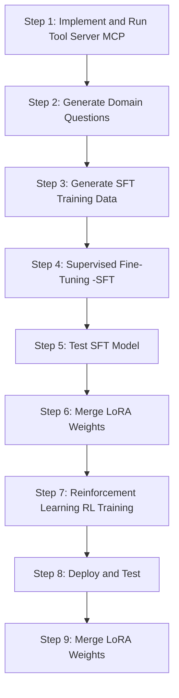

[Read in Chinese](./README_ZH.md)

# EasyTrainAgent
**Feature**: The complete workflow to train your own domain-specific Agent, only requiring MCP tool configuration.

EasyTrainAgent is a project designed to help developers easily train and deploy their own domain-specific intelligent agents. It provides a complete workflow from data generation to model deployment, equipped with a web-based user interface for management and monitoring.

This project consists of two main parts:
- **Backend**: A Python-based environment for generating training data, fine-tuning language models, and serving the final Agent.
- **Frontend**: A Next.js application that provides a user-friendly graphical interface for tasks like project management, file system interaction, command execution, and data labeling.

## ✨ Key Features

### Backend
- **Automated Data Generation**: Automatically generate domain-specific questions and SFT training data based on the tools (APIs) you provide.
- **Supervised Fine-Tuning (SFT)**: Easily fine-tune language models using the generated `jsonl` data to teach them how to call your custom tools.
- **Model Inference Testing**: Test the SFT-finetuned model before merging weights to evaluate its tool-calling capabilities.
- **Reinforcement Learning (RL)**: Provides RL training scripts to further optimize your Agent's performance.
- **Weight Merging**: Merge the trained LoRA weights with the base model to create a complete, deployable model.
- **One-Click Deployment**: Deploy the merged model as an OpenAI-compatible API service using the VLLM framework.

### Frontend (In Development)
- **Project Management**: Initialize and manage different training projects.
- **File System Interaction**: Read, write, and modify files within the project workspace directly from the web interface.
- **Command Execution**: Run shell commands and Python scripts to perform training and management tasks.
- **Log Viewer**: A dedicated interface for real-time viewing of process logs.
- **Data Labeling**: UI tools provided for data annotation tasks.
- **Configuration Wizard**: A step-by-step guide to help you set up your project easily.

### Workflow


## 🛠️ Tech Stack

- **Backend**: Python, FastAPI, PyTorch, VLLM, Unsloth, HuggingFace, ART, LangGraph, A2A, ADK, MCP, Ollama, openai-agents
- **Frontend**: Next.js, TypeScript, Tailwind CSS, Shadcn/ui, Zustand, React Hook Form

## 📂 Project Structure

```
.
├── backend/         # Backend services for training and deployment
└── frontend/        # Next.js frontend interface for management
```

## 🚀 Quick Start

### Prerequisites

- [Python](https://www.python.org/) (3.11 or higher recommended)
- [Node.js](https://nodejs.org/) (20.x or higher recommended)
- Docker, Docker-GPU
- An API Key for a Language Model (LLM), such as OpenAI, for generating training data.

### Installation Steps

1.  **Clone the repository:**
    ```bash
    git clone https://github.com/johnson7788/EasyTrainAgent
    cd EasyTrainAgent
    ```

2.  **Configure the backend:**
    ```bash
    cd backend
    pip install -r requirements.txt
    cp env_template .env
    # Edit the .env file and fill in your API key
    cd ..
    ```

3.  **Configure the frontend:**
    ```bash
    cd frontend
    npm install
    cd ..
    ```

## Backend Training Workflow

The backend provides a complete set of steps to train an agent from scratch.

1.  **Implement and run your tool server (MCP)**: Wrap your tools into an API service. You can refer to the `backend/mcpserver/energy_services.py` file as an example.

2.  **Generate domain questions**: Run `python generate_questions.py` to generate a batch of relevant natural language questions for your tools, which will be saved to `questions.txt`.

3.  **Generate SFT training data**: This step uses the `a2a_agent` module to convert the questions generated in the previous step into a multi-turn dialogue format for SFT training. First, start the Agent service (`cd a2a_agent && python main.py`), then run `python generate_train_data.py` to create the `train.jsonl` file.

4.  **Supervised Fine-Tuning (SFT)**: Use the `python train_tool_sft.py` script and the `train.jsonl` file from the previous step to fine-tune the base model, enabling it to call tools. The LoRA weights will be saved in the `./lora_model` directory.

5.  **Test the SFT model**: Before merging the weights, use the `python inference_tool_sft.py` script to test the tool-calling ability of the fine-tuned model.

6.  **Reinforcement Learning (RL) Training**: To further optimize model performance, you can optionally run `python train.py` in the `rl_train/` directory for reinforcement learning training.

7.  **Merge LoRA weights**: Run `python merge_lora.py` to merge the trained LoRA weights with the base model, creating a complete, directly deployable model.

8.  **Deploy and Test**: Use the VLLM framework to deploy the merged model as an OpenAI-compatible API service.
    ```bash
    # Replace "qwen3-4b-merged" with your model directory name
    python -m vllm.entrypoints.openai.api_server --host 0.0.0.0 --model qwen3-4b-merged
    ```

For more detailed instructions, please refer to [backend/README.md](backend/README.md).

## Frontend Development

The frontend provides a web interface to manage the training process.

1.  **Navigate to the frontend directory:**
    ```bash
    cd frontend
    ```

2.  **Run the development server:**
    ```bash
    npm run dev
    ```

3.  Open [http://localhost:3000](http://localhost:3000) in your browser to use the interface.

For more details on the frontend architecture and components, please see [frontend/README.md](frontend/README.md).

## ✅ Roadmap

- [ ] **Implementation of various frontend functional modules**

## Community

Feel free to connect with me on WeChat for discussions!


