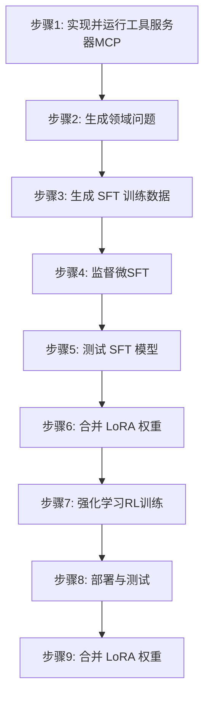

# EasyTrainAgent
特点：全流程训练自己的领域Agent，仅需配置MCP工具。

EasyTrainAgent 是一个旨在帮助开发者轻松训练和部署自己领域专属智能体（Agent）的项目。它提供从数据生成到模型部署的完整工作流程，并配备了一个用于管理和监控的 Web 用户界面。

本项目由两大部分组成：
- **后端**：一个基于 Python 的环境，用于生成训练数据、微调语言模型以及提供最终的 Agent 服务。
- **前端**：一个 Next.js 应用，为管理项目、与文件系统交互、执行命令和数据标注等任务提供友好的图形界面。

## ✨ 主要功能

### 后端
- **自动化数据生成**：根据你提供的工具（API），自动生成领域相关的问题和 SFT 训练数据。
- **监督微调 (SFT)**：使用生成的 `jsonl` 数据轻松微调语言模型，使其学会如何调用你的自定义工具。
- **模型推理测试**：在合并权重之前，可以测试经过 SFT 微调后的模型，以评估其工具调用能力。
- **强化学习 (RL)**：提供 RL 训练脚本，用于进一步优化你的 Agent 性能。
- **权重合并**：将训练好的 LoRA 权重与基础模型合并，生成一个可直接部署的完整模型。
- **一键部署**：使用 VLLM 框架将合并后的模型部署为与 OpenAI 兼容的 API 服务。

### 前端(开发中)
- **项目管理**：初始化和管理不同的训练项目。
- **文件系统交互**：直接在 Web 界面中读取、写入和修改项目工作区内的文件。
- **命令执行**：运行 Shell 命令和 Python 脚本来执行训练和管理任务。
- **日志查看器**：一个专用界面，用于实时查看进程日志。
- **数据标注**：为数据注释任务提供的 UI 工具。
- **配置向导**：一个分步指南，帮助你轻松设置项目。

### 流程


## 🛠️ 技术栈

- **后端**: Python, FastAPI, PyTorch, VLLM, Unsloth, HuggingFace, ART, LangGraph, A2A, ADK, MCP, Ollama, openai-agents
- **前端**: Next.js, TypeScript, Tailwind CSS, Shadcn/ui, Zustand, React Hook Form

## 📂 项目结构

```
.
├── backend/         # 用于训练和部署的后端服务
└── frontend/        # 用于管理的 Next.js 前端界面
```

## 🚀 快速开始

### 环境要求

- [Python](https://www.python.org/) (建议 3.11 或更高版本)
- [Node.js](https://nodejs.org/) (建议 20.x 或更高版本)
- Docker,Docker-GPU
- 一个语言模型（LLM）的 API Key（例如 OpenAI），用于生成训练数据。

### 安装步骤

1.  **克隆仓库:**
    ```bash
    git clone <your-repository-url>
    cd EasyTrainAgent
    ```

2.  **配置后端:**
    ```bash
    cd backend
    pip install -r requirements.txt
    cp env_template .env
    # 编辑 .env 文件并填入你的 API 密钥
    cd ..
    ```

3.  **配置前端:**
    ```bash
    cd frontend
    npm install
    cd ..
    ```

##  后端训练流程

后端提供了一个从零开始训练智能体的完整步骤。

1.  **实现并运行你的工具服务器 (MCP)**：将你的工具封装成一个 API 服务。可参考 `backend/mcpserver/energy_services.py` 文件作为示例。

2.  **生成领域问题**：运行 `python generate_questions.py`，为你的工具生成一批相关的自然语言问题，并保存到 `questions.txt`。

3.  **生成 SFT 训练数据**：此步骤会利用 `a2a_agent` 模块，将上一步生成的问题转化为多轮对话格式的 SFT 训练数据。首先启动 Agent 服务 (`cd a2a_agent && python main.py`)，然后运行 `python generate_train_data.py` 生成 `train.jsonl` 文件。

4.  **监督微调 (SFT)**：使用 `python train_tool_sft.py` 脚本和上一步生成的 `train.jsonl` 文件对基础模型进行微调，使其具备调用工具的能力。LoRA 权重将保存在 `./lora_model` 目录。

5.  **测试 SFT 模型**：在合并权重前，使用 `python inference_tool_sft.py` 脚本来测试微调后模型的工具调用能力。

6.  **强化学习 (RL) 训练**：为了进一步优化模型性能，你可以选择在 `rl_train/` 目录下运行 `python train.py` 进行强化学习训练。

7.  **合并 LoRA 权重**：运行 `python merge_lora.py`，将训练好的 LoRA 权重与基础模型合并，生成一个完整的、可直接部署的模型。

8.  **部署与测试**：使用 VLLM 框架将合并后的模型部署为 OpenAI 兼容的 API 服务。
    ```bash
    # 将 "qwen3-4b-merged" 替换为你的模型目录名
    python -m vllm.entrypoints.openai.api_server --host 0.0.0.0 --model qwen3-4b-merged
    ```

更多详细说明，请参考 [backend/README.md](backend/README.md)。

## 前端开发

前端提供了一个 Web 界面来管理训练过程。

1.  **进入前端目录:**
    ```bash
    cd frontend
    ```

2.  **运行开发服务器:**
    ```bash
    npm run dev
    ```

3.  在浏览器中打开 [http://localhost:3000](http://localhost:3000) 来使用该界面。

有关前端架构和组件的更多详细信息，请参阅 [frontend/README.md](frontend/README.md)。

## ✅ 路线图

- [ ] **前端各个功能模块实现**: 

## 社区交流

欢迎和我微信进行交流！


