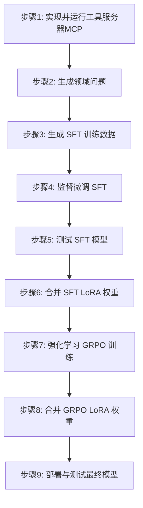

# EasyTrainAgent
特点：全流程训练自己的领域Agent，仅需配置MCP工具。

EasyTrainAgent 是一个旨在帮助开发者轻松训练和部署自己领域专属智能体（Agent）的项目。它提供从数据生成到模型部署的完整工作流程，并配备了一个用于管理和监控的 Web 用户界面。

本项目由两大部分组成：
- **后端**：一个基于 Python 的环境，用于生成训练数据、微调语言模型以及提供最终的 Agent 服务。
- **前端**：一个 Next.js 应用，为管理项目、与文件系统交互、执行命令和数据标注等任务提供友好的图形界面。


## 版本更新
10月10日从ART框架更新到ms-swift框架啦，好处是更适用于国内的网络环境，而且ms-swift可以支持多模态训练。


## 部署使用ms-swfit的镜像
```
# 获取镜像
docker pull modelscope-registry.cn-beijing.cr.aliyuncs.com/modelscope-repo/modelscope:ubuntu22.04-cuda12.6.3-py311-torch2.7.1-vllm0.10.1.1-modelscope1.29.2-swift3.8.1
# 使用哪个GPU, 可以为all，或者某个显卡
docker create --runtime=nvidia --gpus all --net=host --shm-size="10g" --cap-add=SYS_ADMIN -v .:/workspace/verl -v /etc/localtime:/etc/localtime:ro -v /etc/timezone:/etc/timezone:ro --name swift modelscope-registry.cn-beijing.cr.aliyuncs.com/modelscope-repo/modelscope:ubuntu22.04-cuda12.6.3-py311-torch2.7.1-vllm0.10.1.1-modelscope1.29.2-swift3.8.1 sleep infinity
docker create --runtime=nvidia --gpus "device=2" --net=host --shm-size="10g" --cap-add=SYS_ADMIN -v .:/workspace/verl -v /etc/localtime:/etc/localtime:ro -v /etc/timezone:/etc/timezone:ro --name swift modelscope-registry.cn-beijing.cr.aliyuncs.com/modelscope-repo/modelscope:ubuntu22.04-cuda12.6.3-py311-torch2.7.1-vllm0.10.1.1-modelscope1.29.2-swift3.8.1 sleep infinity
# 映射.cache也出来，这里保存模型和数据等
mkdir -p .cache
docker create \
  --runtime=nvidia --gpus all --net=host \
  --shm-size="10g" --cap-add=SYS_ADMIN \
  -v "$(pwd)":/workspace/verl \
  -v "$(pwd)/.cache":/root/.cache \
  -v /etc/localtime:/etc/localtime:ro \
  -v /etc/timezone:/etc/timezone:ro \
  --name swift \
  modelscope-registry.cn-beijing.cr.aliyuncs.com/modelscope-repo/modelscope:ubuntu22.04-cuda12.6.3-py311-torch2.7.1-vllm0.10.1.1-modelscope1.29.2-swift3.8.1 \
  sleep infinity

# 启动容器
docker start swift
docker exec -it swift bash
```

## ~/.bashrc中配置使用的GPU和实用的hugging face镜像
```
export CUDA_VISIBLE_DEVICES=1
export HF_ENDPOINT=https://hf-mirror.com
```

## 设置pip镜像源
```
pip config set global.index-url https://mirrors.tuna.tsinghua.edu.cn/pypi/web/simple
```
## 克隆强化学习训练框架，容器中默认安装的3.8.1的版本，可以升级
```
cd ms-swift
pip install -e .
```

## ✨ 主要功能

### 后端
- **自动化数据生成**：根据你提供的工具（API），自动生成领域相关的问题和 SFT 训练数据。
- **监督微调 (SFT)**：使用生成的 `jsonl` 数据轻松微调语言模型，使其学会如何调用你的自定义工具。
- **模型推理测试**：在合并权重之前，可以测试经过 SFT 微调后的模型，以评估其工具调用能力。
- **强化学习 (RL)**：提供 RL 训练脚本，用于进一步优化你的 Agent 性能。
- **权重合并**：将训练好的 LoRA 权重与基础模型合并，生成一个可直接部署的完整模型。
- **一键部署**：使用 VLLM 框架将合并后的模型部署为与 OpenAI 兼容的 API 服务。

### 流程


## 🛠️ 技术栈

- **后端**: Python, FastAPI, PyTorch, VLLM, Unsloth, HuggingFace, ART, LangGraph, A2A, ADK, MCP, Ollama, openai-agents
- **前端**: Next.js, TypeScript, Tailwind CSS, Shadcn/ui, Zustand, React Hook Form

## 📂 项目结构

```
.
├── backend/         # 用于训练和部署的后端服务
└── frontend/        # 用于管理的 Next.js 前端界面
```

## 🚀 快速开始

### 环境要求

- [Python](https://www.python.org/) (建议 3.11 或更高版本)
- [Node.js](https://nodejs.org/) (建议 20.x 或更高版本)
- Docker,Docker-GPU
- 一个语言模型（LLM）的 API Key（例如 OpenAI），用于生成训练数据。

### 安装步骤

1.  **克隆仓库:**
    ```bash
    git clone https://github.com/johnson7788/EasyTrainAgent
    cd EasyTrainAgent
    ```

## 后端训练流程

后端提供了一个从零开始训练领域 Agent 的完整分步工作流程。每个步骤都在 `backend/` 目录下的相应 `stepX` 文件夹中。

1.  **步骤 1: 实现并运行工具服务器 (MCP)**
    - **目的**: 将你的自定义工具封装成一个 API 服务，以便 Agent 调用。
    - **操作**:
        1.  在 `backend/step1/energy_services.py` 中实现你的工具逻辑。这是一个基于 `FastMCP` 的示例，提供能源价格查询服务。
        2.  启动 MCP 服务器：
            ```bash
            python backend/step1/energy_services.py
            ```
            服务器默认在 `http://localhost:9000` 上运行。

2.  **步骤 2: 生成领域问题**
    - **目的**: 利用大语言模型（LLM）根据你的工具定义，自动生成一批相关的自然语言问题。
    - **操作**:
        - 运行 `generate_questions.py` 脚本，它会读取 `energy_services.py` 的源码并生成问题：
          ```bash
          python backend/step2/generate_questions.py -f backend/step1/energy_services.py -o backend/step2/questions.txt -n 20
          ```
        - 生成的问题将保存在 `backend/step2/questions.txt` 中。

3.  **步骤 3: 生成 SFT 训练数据**
    - **目的**: 利用一个 "教师" Agent 来调用工具回答第二步生成的问题，并将完整的对话（问题、工具调用、工具返回、最终答案）记录下来，形成监督微调（SFT）所需的数据集。
    - **操作**:
        1.  首先，启动一个基于 `LangGraph` 和 `A2A` 协议的 Agent 服务。该 Agent 会加载 `backend/step3/mcp_config.json` 中配置的 MCP 工具。
            ```bash
            cd backend/step3
            python main.py
            ```
        2.  然后，运行 `generate_train_data.py` 脚本，它会读取问题文件，向 Agent 服务提问，并记录交互过程：
            ```bash
            python backend/step3/generate_train_data.py \
              --questions-file backend/step2/questions.txt \
              --output-file backend/step3/train.jsonl \
              --mcp-config backend/step3/mcp_config.json
            ```
        - 最终生成的 SFT 数据集位于 `backend/step3/train.jsonl`。

4.  **步骤 4: 监督微调 (SFT)**
    - **目的**: 使用上一步生成的 `train.jsonl` 数据集对基础语言模型进行微调，使其学会如何正确地调用你的工具。
    - **操作**:
        - 使用 `swift sft` 命令进行 LoRA 微调。具体命令请参考 `backend/step4/README.md`。一个示例命令如下：
          ```bash
          swift sft \
              --model Qwen/Qwen3-4B-Instruct-2507 \
              --train_type lora \
              --dataset backend/step3/train.jsonl \
              --output_dir output/sft_lora
          ```
        - 训练完成后，LoRA 权重将保存在 `--output_dir` 指定的目录中。

5.  **步骤 5: 测试 SFT 模型**
    - **目的**: 在合并权重前，测试经过 SFT 微调后的模型，以评估其工具调用能力。
    - **操作**:
        1.  确保 `step1` 的 MCP 服务器仍在运行。
        2.  使用 `swift deploy` 部署带有 LoRA 适配器的模型，使其成为一个 API 服务。请参考 `backend/step5/README.md` 中的命令。
        3.  修改 `backend/step3/.env` 文件，将 `MODEL_PROVIDER` 设置为 `swift`，并配置 `SWIFT_API_URL` 指向刚部署的模型服务。
        4.  启动 `step3` 的 Agent 服务 (`cd backend/step3 && python main.py`)。
        5.  运行 `a2a_client.py` 客户端进行测试：`python backend/step3/a2a_client.py`。

6.  **步骤 6: 合并 SFT LoRA 权重**
    - **目的**: 将训练好的 SFT LoRA 权重与基础模型合并，生成一个可直接部署的完整模型。
    - **操作**:
        - 使用 `swift export` 命令进行合并。请参考 `backend/step6/README.md`。
          ```bash
          swift export \
            --model Qwen/Qwen3-4B-Instruct-2507 \
            --adapters path/to/sft_lora_checkpoint \
            --merge_lora true \
            --output_dir output/sft_merged
          ```

7.  **步骤 7: 强化学习 (GRPO) 训练**
    - **目的**: 通过强化学习（具体为 GRPO 算法）进一步优化 Agent 的工具调用和决策能力，使其在与环境（即你的工具）的交互中学习得更好。
    - **操作**:
        1.  确保 `step1` 的 MCP 服务器仍在运行。
        2.  配置 `backend/step7/.env` 文件，设置用于评估奖励的 `Ruler` 模型（如 `deepseek-chat`）。
        3.  在一个终端中，启动 `swift rollout` 服务。该服务使用 vLLM 加载模型（通常是 SFT 合并后的模型），并等待 GRPO 训练器连接。
            ```bash
            # 确保 CUDA_VISIBLE_DEVICES 指向一个 GPU
            python backend/step7/start_rollout.py
            ```
        4.  在另一个终端中，启动 GRPO 训练。
            ```bash
            # 确保 CUDA_VISIBLE_DEVICES 指向另一个 GPU
            python backend/step7/grpo_main.py
            ```
        - 训练会产生新的 LoRA 权重，保存在 `output/mcp_agent` 目录中。

8.  **步骤 8: 合并 GRPO LoRA 权重**
    - **目的**: 将经过 RL 训练的 LoRA 权重合并到模型中，得到最终优化后的 Agent 模型。
    - **操作**:
        - 再次使用 `swift export` 命令，但这次使用 GRPO 输出的适配器。
          ```bash
          swift export \
            --model path/to/sft_merged_model \
            --adapters path/to/grpo_lora_checkpoint \
            --merge_lora true \
            --output_dir output/final_agent_model
          ```

9.  **步骤 9: 最终部署与测试**
    - **目的**: 将最终的、完全训练和优化过的模型部署为生产可用的 API 服务。
    - **操作**:
        - 使用 vLLM 直接部署合并后的模型。
          ```bash
          python -m vllm.entrypoints.openai.api_server \
            --host 0.0.0.0 \
            --model path/to/final_agent_model
          ```
        - 你现在可以通过标准的 OpenAI 客户端与你的专属 Agent进行交互了。

更多详细说明，请参考 [backend/README.md](backend/README.md)。

## 前端开发

前端提供了一个 Web 界面来管理训练过程。

1.  **进入前端目录:**
    ```bash
    cd frontend
    ```

2.  **运行开发服务器:**
    ```bash
    npm run dev
    ```

3.  在浏览器中打开 [http://localhost:3000](http://localhost:3000) 来使用该界面。

有关前端架构和组件的更多详细信息，请参阅 [frontend/README.md](frontend/README.md)。

## ✅ 路线图

- [ ] **前端各个功能模块实现**: 

## 社区交流

欢迎和我微信进行交流！


